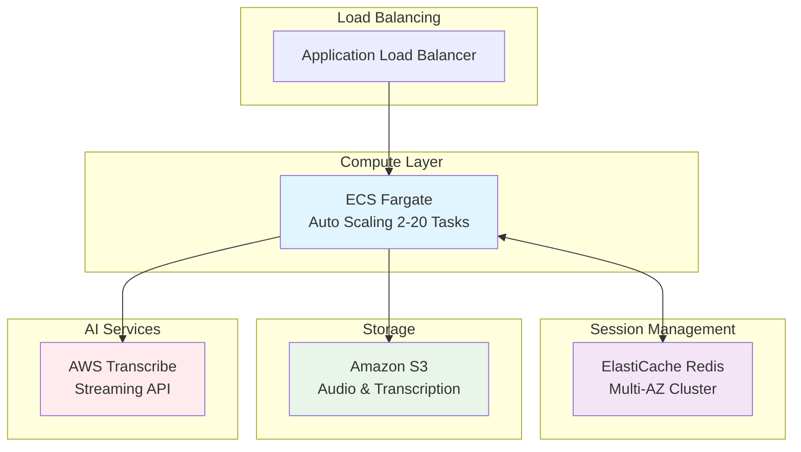

[HealthData x Agent（ヘルスデータエージェント）](https://aws.amazon.com/jp/local/health/healthdata-x-agent/#ls-%E3%82%B3%E3%83%9E%E3%83%BC%E3%82%B7%E3%83%A3%E3%83%AB)  
[MCP](https://modelcontextprotocol.io/docs/getting-started/intro#what-can-mcp-enable%3F)  
[3値論理](https://mickindex.sakura.ne.jp/database/db_3vl.html)  
[Forward Deploy Engineer](https://zenn.dev/hellorusk/articles/f75f6d41b0a30c)  
[Claude Desktop](https://zenn.dev/ito/articles/f9f9037a1fdc9b)
[MCP(データ)](https://business.ntt-east.co.jp/content/cloudsolution/ih_column-193.html)  
[AtCoder World Tour Finals 2025 Heuristic エキシビションについてのchokudaiのブログ](https://chokudai.hatenablog.com/entry/2025/07/21/190935)  

Sidekiq Pro  
GAS clasp  
Dify  

[Bedrock](https://docs.aws.amazon.com/ja_jp/bedrock/latest/userguide/models-supported.html)  

ABCIはLustre  


---------
# インフラストラクチャ設計書 - Voice AI System

> 📚 **関連ドキュメント**: システム全体の技術アーキテクチャは [CORE_SYSTEM_ARCHITECTURE.md](../CORE_SYSTEM_ARCHITECTURE.md) を、AWS Transcribe詳細仕様は [aws-transcribe-features-summary.md](../../_tmp/aws-transcribe-features-summary.md) を参照してください。

## システム概要

**目的**: 診察セッション毎のWebSocketベースリアルタイム音声転写システム  
**対象**: マルチテナント（クリニック毎）対応  
**SLA**: 99.9%可用性、同時1,000セッション対応

## システム特性分析

### 1. リアルタイム性要求

**特徴**:

- WebSocketによる双方向通信（長時間接続維持）
- 音声ストリーミング処理（93ms以下のレイテンシ要求）
- リアルタイム転写結果配信（500ms以下）

**影響**:

- ステートフル接続のためロードバランシング制約
- 高い同時接続数への対応が必要
- ネットワーク品質がユーザー体験に直結

### 2. マルチテナント要求

**特徴**:

- クリニック毎の完全データ分離
- テナント別リソース制限・クォータ管理
- セキュリティ境界の明確化

**影響**:

- データ管理の複雑性増加
- IAM・暗号化の細粒度制御が必要
- パフォーマンス分離の考慮

### 3. 可変負荷特性

**特徴**:

- 診察時間帯による負荷変動（9-17時にピーク）
- セッション開始時の一時的負荷集中
- 不定期な大量転写処理

**影響**:

- 弾性的スケーリングが必須
- リソース予測の困難性
- コスト効率とパフォーマンスのトレードオフ

### 4. データ機密性要求

**特徴**:

- 医療情報（音声・転写データ）の厳格な保護
- 法的コンプライアンス（個人情報保護法・医療法）
- アクセス制御とログ監査の要求

**影響**:

- 暗号化の多層実装
- ネットワーク分離とアクセス制御の強化
- 運用・監査プロセスの厳格化

## アーキテクチャ概要



## コンポーネント構成

### Application Load Balancer (ALB)

- **役割**: WebSocketセッションの負荷分散
- **特徴**:
  - スティッキーセッション対応
  - ヘルスチェック統合
  - SSL終端

### ECS Fargate

- **役割**: アプリケーション実行基盤
- **設定**:
  - CPU: 1 vCPU, Memory: 2 GB
  - Auto Scaling: 2-20 tasks
  - Multi-AZ配置

### ElastiCache Redis

- **役割**: セッション管理・WebSocket接続情報の共有
- **設定**:
  - Multi-AZ cluster (Primary + Replica)
  - クラスターモード対応
  - 暗号化有効

### Amazon S3

- **役割**: 音声ファイル・転写結果の永続化
- **構造**: `s3://bucket/{clinicId}/{sessionId}/`
- **特徴**:
  - Intelligent Tiering
  - KMS暗号化
  - ライフサイクル管理

### AWS Transcribe

- **役割**: リアルタイム音声転写
- **設定**:
  - Streaming API使用
  - 16kHz PCM対応
  - 日本語・英語対応

## 設計選択理由と代替案検討

### 1. コンピュート基盤選択

#### 採用: ECS Fargate

**理由**:

- サーバーレスコンテナ環境で運用負荷軽減
- 細かい粒度でのオートスケーリング
- WebSocket長時間接続に適したタスク管理

**検討したが採用しなかった選択肢**:

| 選択肢     | メリット                       | 採用しなかった理由                        |
| ---------- | ------------------------------ | ----------------------------------------- |
| ECS EC2    | コスト効率、カスタマイズ性     | 運用負荷、スケーリング速度                |
| Lambda     | 完全サーバーレス、コスト効率   | 15分実行制限、WebSocketセッション維持困難 |
| EKS        | 高い柔軟性、マルチクラウド対応 | 運用複雑性、オーバーエンジニアリング      |
| EC2 Direct | 最大カスタマイズ性             | インフラ運用負荷、スケーリング実装コスト  |

### 2. ロードバランサー選択

#### 採用: Application Load Balancer (ALB)

**理由**:

- WebSocketのスティッキーセッション対応
- Layer 7ルーティング（パス・ヘッダベース）
- AWS統合監視・ログ

**検討したが採用しなかった選択肢**:

| 選択肢                | メリット                     | 採用しなかった理由              |
| --------------------- | ---------------------------- | ------------------------------- |
| Network Load Balancer | 高スループット、低レイテンシ | WebSocketルーティング機能不足   |
| CloudFront            | グローバル配信、キャッシュ   | WebSocket動的コンテンツに不適合 |
| API Gateway           | サーバーレス、統合認証       | WebSocket長時間接続制限、コスト |

### 3. セッション管理選択

#### 採用: ElastiCache Redis

**理由**:

- 高速インメモリ処理
- Multi-AZ自動フェイルオーバー
- Pub/Sub機能でWebSocket通知配信

**検討したが採用しなかった選択肢**:

| 選択肢               | メリット                     | 採用しなかった理由                     |
| -------------------- | ---------------------------- | -------------------------------------- |
| DynamoDB             | 完全マネージド、無限スケール | 複雑クエリ制限、コスト高               |
| RDS                  | ACID特性、複雑クエリ         | セッション管理には過剰、パフォーマンス |
| MemoryDB             | Redis互換、永続化            | セッションデータに永続化不要、コスト   |
| インスタンス内メモリ | 最速アクセス                 | スケーラビリティ制約、障害耐性         |

### 4. 音声転写サービス選択

#### 採用: AWS Transcribe

**理由**:

- ストリーミングAPI対応
- 医療用語カスタム語彙対応
- AWS統合セキュリティ

**検討したが採用しなかった選択肢**:

| 選択肢                | メリット               | 採用しなかった理由                     |
| --------------------- | ---------------------- | -------------------------------------- |
| Google Speech-to-Text | 高精度、多言語対応     | マルチクラウド運用複雑性、データ管轄   |
| Azure Speech Services | 高精度、カスタムモデル | マルチクラウド運用複雑性、コスト       |
| オンプレミス音声認識  | データ管轄完全制御     | 運用負荷、スケーラビリティ、技術コスト |
| OpenAI Whisper API    | 高精度、コスト効率     | 医療特化不十分、SLA制約                |

### 5. ストレージ戦略選択

#### 採用: Amazon S3

**理由**:

- 99.999999999%の耐久性
- ライフサイクル管理・コスト最適化
- 暗号化・アクセス制御統合

**検討したが採用しなかった選択肢**:

| 選択肢 | メリット                | 採用しなかった理由           |
| ------ | ----------------------- | ---------------------------- |
| EFS    | POSIX互換、同時アクセス | 音声ファイルには過剰、コスト |
| EBS    | 高IOPS、低レイテンシ    | インスタンス依存、可用性制約 |
| FSx    | 高性能ファイルシステム  | 音声アーカイブには過剰仕様   |

## 設計観点

### 1. マルチテナント対応

#### データ分離

- **Redis**: キー構造 `clinic:{clinicId}:session:{sessionId}`
- **S3**: ディレクトリ階層分離
- **IAM**: テナント別アクセス制御

#### リソース分離

- CPU・メモリクォータ管理
- 同時セッション数制限
- ストレージクォータ管理

### 2. 高可用性

#### Multi-AZ構成

- ECS Fargate: 複数AZ配置
- ElastiCache: Primary-Replica構成
- ALB: 複数AZ分散

#### 障害対応

- Auto Scaling: ヘルスチェック連動
- Connection Draining: グレースフル停止
- Redis Failover: 自動切り替え

### 3. セキュリティ

#### ネットワーク

- VPC Private Subnet配置
- Security Group最小権限
- TLS 1.3暗号化

#### データ保護

- KMS暗号化（テナント別キー）
- S3バケットポリシー
- IAMロール最小権限

## ストリーミング処理ボトルネック分析

### 1. 音声データパイプライン

#### 処理フロー

```
クライアント → WebSocket → ALB → ECS Task → Transcribe → Redis → WebSocket → クライアント
    93ms        <10ms     <5ms     <3ms      ~70ms    <5ms      <10ms       93ms
```

#### 特定ボトルネック

**1. WebSocket接続処理**

- **ボトルネック**: 1タスクあたり500接続限界
- **原因**: Node.js EventLoopとメモリ制限
- **対策**:
  - タスク数増加によるスケール
  - 接続プールと負荷分散最適化

**2. 音声チャンクバッファリング**

- **ボトルネック**: メモリ使用量とGC頻度
- **原因**: 音声データ蓄積（16kHz PCM = 32KB/s）
- **対策**:
  - ストリーミングバッファサイズ最適化（512KB固定）
  - Worker Threadsによる並列処理

**3. AWS Transcribe API制限**

- **ボトルネック**: 同時ストリーム数制限
- **原因**: リージョン別クォータ制限
- **対策**:
  - 複数リージョン分散
  - ストリーム優先度制御

**4. Redis Pub/Sub配信**

- **ボトルネック**: 大量接続への配信遅延
- **原因**: Single-threaded Redis特性
- **対策**:
  - Redis Cluster構成
  - チャンネル分割による負荷分散

### 2. リアルタイム性能制約

#### レイテンシ構成要素

| コンポーネント | 目標値    | 実際の範囲   | 最適化ポイント           |
| -------------- | --------- | ------------ | ------------------------ |
| WebSocket RTT  | <10ms     | 5-15ms       | CDN配置、地理的分散      |
| ALB処理        | <5ms      | 2-8ms        | ヘルスチェック最適化     |
| ECS Task処理   | <3ms      | 1-5ms        | CPU・メモリ適正化        |
| Transcribe API | <70ms     | 50-100ms     | ストリーム設定最適化     |
| Redis操作      | <5ms      | 1-3ms        | 接続プール管理           |
| **総合**       | **<93ms** | **59-131ms** | **エンドツーエンド監視** |

#### スループット制約

**同時セッション数**:

- 単一タスク制限: 500セッション
- クラスター最大: 10,000セッション（20タスク）
- 制約要因: Transcribe同時ストリーム数

**データ処理量**:

- 音声入力: 32KB/s/セッション
- 転写出力: 平均500字/分 = 50KB/分
- ピーク処理: 320MB/s（1,000セッション）

### 3. スケーラビリティ制約

#### 垂直スケーリング限界

**ECS Task仕様**:

- 現行: 1vCPU, 2GB Memory
- 限界: 4vCPU, 8GB Memory
- 制約: WebSocket接続あたりメモリ消費（4MB/接続）

**Redis制約**:

- 現行: cache.r6g.large (13.07GB)
- 限界: cache.r6g.xlarge (25.05GB)
- 制約: セッション情報サイズ（25KB/セッション）

#### 水平スケーリング課題

**1. セッション固着性**

- WebSocket接続は特定タスクに固定
- タスク障害時の接続移行困難
- 対策: 接続復旧とセッション引継ぎ機能

**2. 状態共有**

- Redis経由の状態同期遅延
- 複数タスク間のデータ整合性
- 対策: イベント駆動アーキテクチャ

**3. 冷却時間**

- タスク起動時間（45-60秒）
- Transcribeストリーム確立時間（2-3秒）
- 対策: 事前ウォーミングとプリプロビジョニング

## スケーラビリティ観点

### 水平スケーリング戦略

#### WebSocketセッション管理

- **課題**: WebSocketは特定インスタンスとの永続接続
- **解決策**:
  - ALBスティッキーセッション
  - Redisセッション共有でインスタンス間移行対応
  - 接続断時の自動復旧

#### Auto Scaling設定

```yaml
Triggers:
  - CPU使用率 > 70% (5分継続)
  - メモリ使用率 > 80% (5分継続)
  - アクティブ接続数 > 500/instance

Scale Out: 1-3 tasks追加 (3-5分)
Scale In: 1 task削除 (10分クールダウン)
```

### 垂直スケーリング

- リソースモニタリングベースの最適化
- ピーク時間帯のリソース事前増強
- 段階的タスクサイズ調整

### データベース・キャッシュ

- Redis Cluster: 水平分散
- Connection Pooling: 効率的な接続管理
- データパーティショニング: テナント別分散

## パフォーマンス要件

### レスポンス時間目標

- WebSocket接続確立: < 1秒
- 音声チャンク処理: < 93ms
- 転写結果取得: < 500ms

### 最適化ポイント

- 音声バッファリング戦略
- S3並列アップロード
- Redis接続プール管理
- 転写処理並列化

## 監視・アラート

### 重要メトリクス

- **可用性**: ECSタスク健全性、ALBターゲット健全性
- **パフォーマンス**: レスポンス時間、CPU・メモリ使用率
- **容量**: アクティブセッション数、ストレージ使用量
- **エラー**: 4xx/5xx エラー率、転写失敗率

### アラート設定

```yaml
Critical:
  - ECS Task停止 (即座)
  - Active Sessions > 800 (2分継続)
  - Error Rate > 5% (5分継続)

Warning:
  - CPU > 70% (10分継続)
  - Memory > 80% (10分継続)
  - Storage使用量 > 80%
```

### ログ戦略

- 構造化ログ（JSON形式）
- 分散トレーシング（X-Ray）
- セッションIDベースのログ集約

## 運用考慮事項

### デプロイメント

- Blue-Green Deploy（ゼロダウンタイム）
- Rolling Update（段階的更新）
- Feature Flag対応

### バックアップ・復旧

- Redis: 日次自動バックアップ
- S3: Cross-Region Replication
- 設定: Infrastructure as Code

### コスト最適化

- Fargate Spot利用（30%）
- S3 Intelligent Tiering
- 時間帯別Auto Scaling
- 未使用リソース定期削除

### セキュリティ運用

- 定期セキュリティパッチ
- アクセスログ監査
- IAMロール定期レビュー
- 暗号化キーローテーション

## AWSサービスクォータ制限と対策

### 1. Amazon Transcribe制限

#### リアルタイムストリーミング

| 項目                               | デフォルト制限 | 要求値  | 申請必要性 |
| ---------------------------------- | -------------- | ------- | ---------- |
| 同時ストリーム数（ap-northeast-1） | 100            | 1,000   | **要申請** |
| ストリーム継続時間                 | 4時間          | 2時間   | 問題なし   |
| 音声チャンクサイズ                 | 最大256KB      | 32KB    | 問題なし   |
| リクエスト率                       | 25req/s        | 50req/s | **要申請** |

**対策**:

- 複数リージョン分散（ap-northeast-1, ap-southeast-1, us-west-2）
- ストリーム優先度制御とキューイング実装
- 定期的な制限監視とアラート設定

#### バッチ転写（補助機能）

| 項目               | デフォルト制限 | 要求値 | 申請必要性 |
| ------------------ | -------------- | ------ | ---------- |
| 同時ジョブ数       | 100            | 50     | 問題なし   |
| ファイル最大サイズ | 2GB            | 100MB  | 問題なし   |

### 2. ECS Fargate制限

#### タスク・クラスター制限

| 項目                     | デフォルト制限 | 要求値 | 申請必要性 |
| ------------------------ | -------------- | ------ | ---------- |
| タスク数（リージョン）   | 1,000          | 20     | 問題なし   |
| サービス数（クラスター） | 2,000          | 1      | 問題なし   |
| vCPU（リージョン）       | 25,000         | 80     | 問題なし   |
| メモリ（GB）             | 50,000         | 160    | 問題なし   |

#### 起動レート制限

| 項目             | デフォルト制限 | 要求値      | 申請必要性 |
| ---------------- | -------------- | ----------- | ---------- |
| タスク起動レート | 100タスク/分   | 20タスク/分 | 問題なし   |
| Auto Scaling頻度 | 30秒間隔       | 60秒間隔    | 問題なし   |

### 3. ElastiCache Redis制限

#### 接続・クラスター制限

| 項目                     | デフォルト制限 | 要求値 | 申請必要性 |
| ------------------------ | -------------- | ------ | ---------- |
| ノード数（リージョン）   | 300            | 3      | 問題なし   |
| 同時接続数（ノード）     | 65,000         | 20,000 | 問題なし   |
| メモリ（GB/ノード）      | 317.77         | 25.05  | 問題なし   |
| ネットワーク帯域（Mbps） | 25,000         | 5,000  | 問題なし   |

#### 操作レート制限

| 項目                 | デフォルト制限 | 要求値      | 申請必要性 |
| -------------------- | -------------- | ----------- | ---------- |
| APIコール レート     | 制限なし       | 1,000 req/s | 問題なし   |
| Pub/Sub チャンネル数 | 制限なし       | 1,000       | 問題なし   |

### 4. Application Load Balancer制限

#### リクエスト処理制限

| 項目           | デフォルト制限 | 要求値  | 申請必要性 |
| -------------- | -------------- | ------- | ---------- |
| 新規接続レート | 25,000/s       | 1,000/s | 問題なし   |
| 同時接続数     | 100,000        | 10,000  | 問題なし   |
| ターゲット数   | 1,000          | 20      | 問題なし   |
| リスナー数     | 50             | 2       | 問題なし   |

#### WebSocket制限

| 項目                 | デフォルト制限 | 要求値 | 申請必要性       |
| -------------------- | -------------- | ------ | ---------------- |
| アイドルタイムアウト | 60秒（固定）   | 3600秒 | **設定変更必要** |
| WebSocket接続数      | 制限なし       | 10,000 | 問題なし         |

### 5. Amazon S3制限

#### リクエスト制限

| 項目                         | デフォルト制限 | 要求値      | 申請必要性 |
| ---------------------------- | -------------- | ----------- | ---------- |
| PUT/COPY/POST/DELETE         | 3,500 req/s    | 500 req/s   | 問題なし   |
| GET/HEAD                     | 5,500 req/s    | 1,000 req/s | 問題なし   |
| 同時マルチパートアップロード | 制限なし       | 100         | 問題なし   |

#### ストレージ制限

| 項目               | デフォルト制限 | 要求値 | 申請必要性 |
| ------------------ | -------------- | ------ | ---------- |
| バケット数         | 100            | 5      | 問題なし   |
| オブジェクト数     | 制限なし       | 10M    | 問題なし   |
| オブジェクトサイズ | 5TB            | 100MB  | 問題なし   |

### 6. IAM・セキュリティ制限

#### IAMエンティティ制限

| 項目        | デフォルト制限 | 要求値 | 申請必要性 |
| ----------- | -------------- | ------ | ---------- |
| IAMロール数 | 1,000          | 20     | 問題なし   |
| ポリシー数  | 1,500          | 50     | 問題なし   |
| KMSキー数   | 100,000        | 100    | 問題なし   |

### 7. 監視・制限管理戦略

#### クォータ監視

```yaml
監視対象:
  - Transcribe同時ストリーム数: 閾値80%でアラート
  - ECS Task起動レート: 1分間平均50タスク/分でアラート
  - Redis接続数: ノードあたり90%でアラート
  - S3リクエスト数: 1分間平均80%でアラート

自動対応:
  - Transcribeストリーム数上限: 待機キューへ
  - ECS起動レート制限: 段階的スケール実装
  - Redis接続上限: 接続プール制御
```

#### 制限回避アーキテクチャ

- **地理的分散**: 複数リージョンによる制限分散
- **時間的分散**: オフピーク時の事前プロビジョニング
- **代替手段**: 制限達成時のフォールバック機能
- **制限予測**: 利用パターン分析による事前申請

#### 制限申請プロセス

1. **定期レビュー**: 月次利用状況確認
2. **事前申請**: 成長予測に基づく3ヶ月前申請
3. **緊急申請**: ビジネス要求に基づく即時申請
4. **承認トラッキング**: 申請状況と承認タイムライン管理

## 障害対応

### RTO/RPO目標

- RTO: 30分（Recovery Time Objective）
- RPO: 5分（Recovery Point Objective）

### エスカレーション

1. **自動復旧**: Auto Scaling、ヘルスチェック
2. **アラート通知**: オンコール担当者
3. **手動対応**: 運用チーム介入
4. **緊急対応**: 開発チーム参加

### 定期テスト

- 月次: 部分障害テスト
- 四半期: フル災害復旧テスト
- 年次: 総合的なBCP訓練
