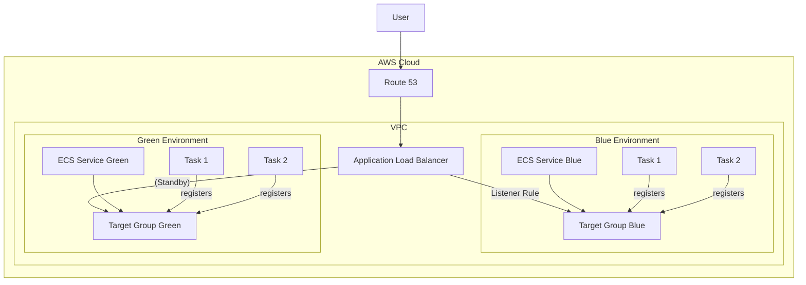

# リアルタイム音声ストリーミングサービスのためのBlue/Greenデプロイメント戦略

## 1. 概要

本ドキュメントは、リアルタイム音声ストリーミングサービスにおける、サービス無停止（ゼロダウンタイム）デプロイメントを実現するためのインフラ設計とデプロイ戦略について記述するものです。
特に、長時間持続するWebSocket接続を、デプロイ時に切断することなく安全に新しい環境へ移行させることを最重要目標とします。

## 2. 課題：ステートフルなWebSocket接続の維持

通常のHTTPリクエストとは異なり、WebSocketはステートフルで長時間の接続を維持します。従来の単純なローリングアップデートやBlue/Greenデプロイメント手法では、旧バージョンのインスタンスを停止する際に既存の接続が強制的に切断され、ユーザー体験を損なうリスクがありました。
本戦略では、この課題を解決し、アクティブなセッション（例：診察中の音声ストリーム）を中断させないことを目指します。

## 3. 推奨インフラストラクチャ設計

ゼロダウンタイムと接続維持を実現するため、以下のAWSサービスを組み合わせたアーキテクチャを提案します。

- **Route 53**: DNSによる名前解決
- **Application Load Balancer (ALB)**: トラフィックの分散とルーティング
- **ECS Fargate**: コンテナ化されたアプリケーションの実行環境

### アーキテクチャ図

この設計では、Blue（現行バージョン）とGreen（新バージョン）の2つの独立した環境を並行して稼働させます。各環境はステートレスであり、セッション状態を外部で共有する必要はありません。ALBがトラフィックの切り替えを担います。

## 4. トラフィック切り替え方式の比較検討

デプロイ時に新バージョン（Green）へトラフィックを切り替える主要な方式として、**DNS (Route 53) 切り替え**と**ALB Target Group 切り替え**の2つが考えられます。

| 比較項目             | DNS (Route 53) 切り替え                                       | ALB Target Group 切り替え                                              |
| -------------------- | ------------------------------------------------------------- | ---------------------------------------------------------------------- |
| **切り替え速度**     | 遅い（数分〜数時間）                                          | **ほぼ瞬時**                                                           |
| **仕組み**           | DNSレコードをGreen環境のALBに向ける                           | ALBのリスナールールを変更し、トラフィックをGreenのTarget Groupに向ける |
| **影響範囲**         | DNSキャッシュに依存するため、全ユーザーが同時に切り替わらない | ALBに到達する全トラフィックが即座に切り替わる                          |
| **ロールバック**     | 遅い。再度DNSの変更と伝播待機が必要                           | **ほぼ瞬時**。リスナールールを元に戻すだけ                             |
| **きめ細やかな制御** | 不可                                                          | 加重ターゲットグループによるカナリアリリースも可能                     |
| **複雑性**           | シンプル                                                      | やや複雑。ALBとTarget Groupの理解が必要                                |

### 結論：ALB Target Group 切り替えの採用

WebSocketのようなステートフルなアプリケーションでは、トラフィックの切り替えとロールバックを迅速かつ確実に行うことが極めて重要です。
DNS切り替え方式は、DNSキャッシュの伝播遅延により、新旧両方の環境にトラフィックが長期間混在する可能性があり、接続の管理を複雑にします。

一方、**ALB Target Group 切り替え方式**は、トラフィックの移行が瞬時に完了するため、この問題を解消できます。ロールバックも同様に高速であるため、万が一新バージョンに問題があった場合でも、迅速に元の状態に戻すことができ、サービスへの影響を最小限に抑えられます。

したがって、本システムでは**ALB Target Group 切り替え方式**を最適な戦略として採用します。

## 5. 接続を維持するデプロイフロー

ALB Target Group 切り替え方式と、ECSの**接続ドレイニング（Connection Draining）**機能を組み合わせることで、既存のWebSocket接続を維持したまま安全なデプロイを実現します。

### フェーズ1: Green環境の準備

1.  **コードのデプロイ**: 新しいバージョンのアプリケーションコードを含むDockerイメージをECRにプッシュします。
2.  **Green環境のプロビジョニング**:
    - 新しいECSタスク定義を作成します。
    - そのタスク定義を使用する新しいECSサービス（Greenサービス）とTarget Group（Green Target Group）を作成します。
    - この時点では、Green環境にトラフィックは流れません。

### フェーズ2: トラフィックの切り替え

1.  **ALBリスナールールの変更**:
    - ALBの関連するリスナールールを更新し、トラフィックの転送先をBlue Target Groupから**Green Target Group**に切り替えます。
    - この変更は即座に反映され、**すべての新しい接続**はGreen環境に向けられるようになります。

### フェーズ3: Blue環境の安全な縮退（Graceful Shutdown）

ここが最も重要なプロセスです。

1.  **BlueサービスのDesired Countを0に更新**:

    - Blue環境のECSサービスのタスクの必要数を `0` に設定します。
    - これにより、ECSはBlue環境のタスクを停止し、ALBのTarget Groupから登録解除するプロセスを開始します。

2.  **ALBによる接続ドレイニング**:

    - タスクが登録解除される際、ALBは即座にタスクを終了しません。
    - ALBは登録解除中のタスクに対して**新しい接続の送信を停止**します。
    - しかし、**既存のWebSocket接続は維持**され、クライアントが切断するか、設定されたドレイニングタイムアウト（`deregistration_delay.timeout_seconds`）に達するまで通信を継続できます。
    - これにより、診察中のセッションがデプロイによって突然中断されることを防ぎます。

3.  **タスクの安全な停止**:
    - すべての既存接続が終了すると、タスクは安全に停止されます。
    - タイムアウト時間内に接続が終了しなかった場合、タスクは強制的に停止されます。最大接続時間は30分とのことですので、タイムアウト値はこの最大長よりも十分に長く設定する必要があります（例：35分〜40分に相当する2100〜2400秒）。

### フェーズ4: クリーンアップ

1.  **Blue環境の削除**: Blue環境のすべての接続がなくなり、タスクが完全に停止したことを確認した後、不要になったECSサービスやTarget Groupなどのリソースを削除します。

このフローにより、ユーザーはデプロイを意識することなく、サービスを継続して利用できます。
